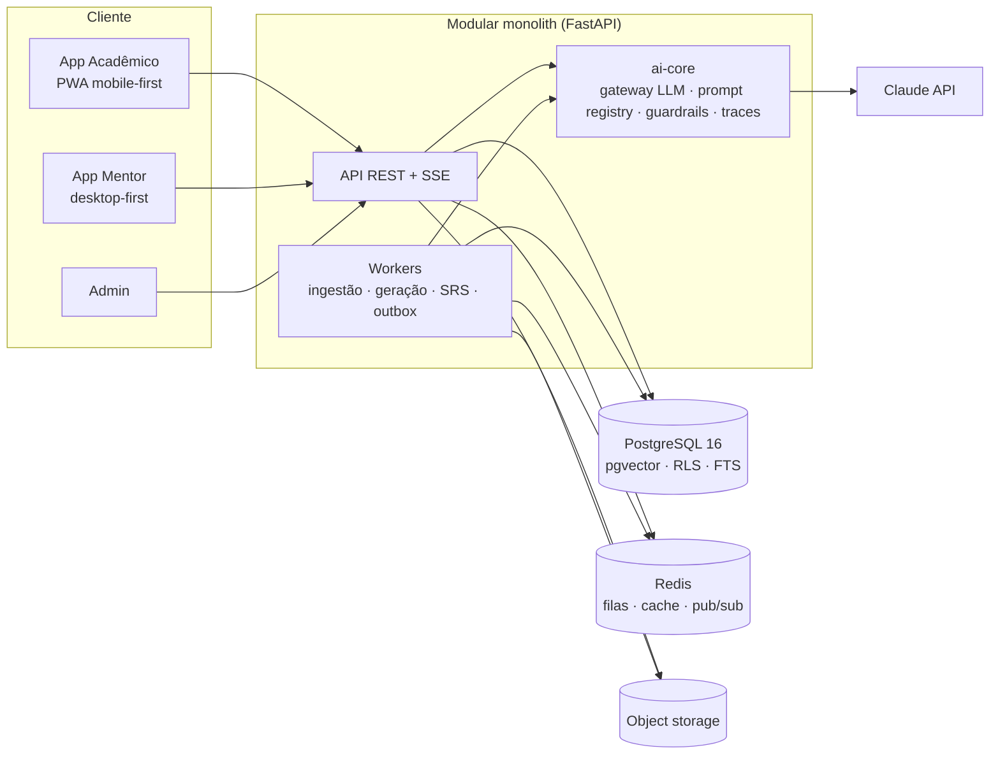

# ghdarulms — Especificação do Sistema Educacional com IA

**Versão:** 0.1 (proposta consolidada) · **Data:** 2026-09-11 · **Idioma:** pt-BR

> Frase-âncora: **o mentor traz o conteúdo, a IA constrói a trilha por Bloom, o acadêmico aprende fazendo no celular com um tutor que conhece o material.**

Este documento consolida as contribuições de nove especialistas convocados para desenhar o sistema: pedagogia/Bloom, IA educacional, active learning, três de UX (mobile/microlearning, jornada/engajamento, mentor/autoria), plataformas educacionais, arquitetura backend e arquitetura frontend. As contribuições integrais estão em [`docs/especialistas/`](especialistas/) e são referenciadas pelos IDs de requisito (PED-, AL-, IA-, UXM-, UXJ-, UXA-, PLT-, BE-, FE-). Onde os especialistas divergiram, a seção 10 registra a decisão tomada e o motivo.

---

## 1. Visão, atores e princípios

### 1.1 O problema

Mentores têm conteúdo (PDFs, slides, vídeos, notas) e intenção pedagógica, mas não têm tempo para transformar isso em prática estruturada. Alunos consomem conteúdo passivamente e não retêm. Plataformas existentes ou exigem autoria artesanal (Brilliant), ou medem consumo em vez de domínio (Udemy, MOOCs), ou não aceitam o material do próprio mentor (Khan, Duolingo).

### 1.2 A proposta

1. O **mentor** insere o material e define o **objetivo geral da disciplina usando a Taxonomia de Bloom** (nível-alvo e verbo de ação).
2. A **IA** decompõe o material em um **grafo de conceitos** com pré-requisitos, gera **objetivos de aprendizagem por nível de Bloom**, **micro-lições de 3 a 7 minutos**, atividades por nível e sugere **material complementar** com fonte e licença. Nada é publicado sem aprovação do mentor.
3. O **acadêmico** evolui conceito a conceito, nível a nível, no **celular**, com um **tutor de IA** que conhece o material do mentor (RAG com citações), acompanha seu estado de maestria e nunca dá a resposta antes da hora.
4. O progresso é **maestria demonstrada por (conceito × nível Bloom)**, com **revisão espaçada**, e nunca "assistiu 80%".

### 1.3 Atores

| Ator | Papel |
|---|---|
| **Mentor** | Autor e autoridade pedagógica. Insere conteúdo, define alcance Bloom, revisa e aprova o que a IA gera, acompanha a turma, intervém, avalia artefatos de Avaliar/Criar. |
| **Acadêmico (aluno)** | Aprende fazendo em micro-sessões; escolhe ritmo e ordem entre o que está desbloqueado; conversa com o tutor; contesta avaliações. |
| **Tutor de IA** | Agente conversacional grounded no material do mentor; socrático por padrão; registra evidências de maestria com peso reduzido; escala ao mentor. |
| **Agentes de autoria de IA** | Curador/Ingestor, Designer Instrucional, Gerador de Atividades, Buscador de Material, Avaliador, Detector de Misconceptions, Planejador de Revisão. Trabalham em batch, produzem rascunhos. |
| **Co-mentor / Monitor** | Acompanha turma, avalia fila humana, não edita conteúdo (salvo se autorizado). |
| **Admin de instituição** | Gerencia tenant: usuários, SSO, LTI, cotas de IA, relatórios agregados. |
| **Super-admin** | Plataforma: tenants, planos, custo de IA, moderação. |

### 1.4 Princípios de produto (não negociáveis)

1. **Bloom é o eixo de progressão, não um rótulo.** Toda atividade pertence a exatamente um par (conceito, nível). Objetivos usam verbos observáveis; "entender/saber/conhecer" são rejeitados pelo validador. (PED-01, PED-02)
2. **Fazer antes de ler.** Nenhuma micro-lição começa com exposição; começa com tentativa. (AL-01)
3. **Progresso só por evidência.** Tempo de tela, vídeos assistidos e telas vistas nunca avançam progresso. (AL-34, PLT-03)
4. **O mentor decide.** Todo artefato de IA nasce como rascunho e exige aprovação antes de chegar ao aluno. (PED-15, IA-06, BE-10)
5. **O tutor cita ou se abstém.** Toda afirmação factual aponta para o material do mentor; fora dele, diz que não está no material. (IA-07, PED-14, UXJ-05)
6. **O tutor não dá a resposta antes da hora.** Escada de dicas com política configurável pelo mentor; nunca em item de evidência ou revisão espaçada. (PED-13, IA-09, AL-30)
7. **Mobile-first, uma tarefa por tela, sessão interrompível.** (UXM-01, UXM-03)
8. **Retenção ética.** Sem streak que zera, sem ranking, sem escassez artificial, pausar sem culpa. (UXJ-12, UXJ-14, AL-18)
9. **Transparência da IA.** Selo de origem (Mentor / IA / IA revisado), "por que estou vendo isto", reportar em 1 toque, contestação com escalada. (UXJ-06, UXJ-08, UXJ-09)
10. **Multi-tenant seguro e LGPD desde o dia 1.** RLS no banco, PII redigida antes do modelo, exportação e exclusão de dados. (BE-02, IA-13, BE-18)

---

## 2. A Taxonomia de Bloom no sistema

### 2.1 Tabela canônica de verbos

Esta é a grade que o mentor vê ao definir o alcance da disciplina e que o validador de objetivos usa. Baseada na taxonomia revisada (Anderson & Krathwohl) e na grade fornecida pelo projeto.

| Nível | Pergunta-guia | Verbos de ação |
|---|---|---|
| **1 Memorizar** | "O que é?" | Listar, Relembrar, Reconhecer, Identificar, Localizar, Descrever, Citar, Nomear, Definir |
| **2 Compreender** | "Por que / como funciona?" | Esquematizar, Relacionar, Explicar, Demonstrar, Parafrasear, Associar, Converter, Exemplificar, Resumir |
| **3 Aplicar** | "Como uso isso aqui?" | Utilizar, Implementar, Modificar, Experimentar, Calcular, Demonstrar, Classificar, Executar, Resolver (rotineiro) |
| **4 Analisar** | "Quais são as partes e como se relacionam?" | Resolver (não rotineiro), Categorizar, Diferenciar, Comparar, Explicar (causas), Integrar, Investigar, Decompor, Atribuir |
| **5 Avaliar** | "Qual é melhor e por quê?" | Defender, Delimitar, Estimar, Selecionar, Justificar, Comparar (com critérios), Explicar (juízo), Criticar, Julgar, Priorizar |
| **6 Criar** | "O que posso construir com isso?" | Elaborar, Desenhar, Produzir, Prototipar, Traçar, Idear, Inventar, Planejar, Compor |

Verbos que aparecem em mais de um nível (Demonstrar, Explicar, Comparar, Classificar, Resolver) são desambiguados pelo objeto e pela condição do objetivo; o validador exige que o mentor ou a IA escolham o nível explicitamente e alerta quando o verbo é ambíguo.

### 2.2 Alcance (nível-alvo)

- **Alcance da disciplina**: escolhido pelo mentor em um seletor único (Memorizar … Criar). Tudo à esquerda vira "nível de base".
- **Alcance por conceito**: a IA propõe (com justificativa: "conceito instrumental, sugerido Aplicar") e o mentor confirma ou altera em uma grade Conceito × Nível. Alcance do conceito ≤ alcance da disciplina.
- **Regra de continuidade**: todo conceito gera objetivos consecutivos do nível 1 até o alcance. O currículo não pula nível; o aluno pode pular via diagnóstico ou teste de maestria.
- **Regra de contexto**: objetivos de níveis 4 a 6 exigem um caso, cenário ou dilema ancorado no material; sem contexto não há análise, avaliação ou criação.

### 2.3 Objetivo de aprendizagem

Formato obrigatório: **"Ao final, o aluno será capaz de [verbo] [objeto] [condição/critério]"**. Um por nível até o alcance. Cada objetivo tem no mínimo 2 atividades (uma de ensino, uma de evidência) e 1 item de revisão espaçada. (PED-01, IA-03, UXA-02)

### 2.4 Evidência de maestria por nível

| Nível | O que prova | Critério de "dominado" | Quem corrige |
|---|---|---|---|
| Memorizar | Reconhecimento **e** evocação livre | ≥ 85% em ≥ 6 itens (≥ 2 de evocação livre) em ≥ 2 sessões distintas | Automático |
| Compreender | Explicação com palavras próprias, exemplo próprio, classificação de casos novos | Rubrica IA ≥ 3/4 em 2 artefatos; ≥ 80% em casos não vistos | Auto + IA com rubrica |
| Aplicar | Procedimento em problema **novo** (parâmetros variados) | ≥ 80% em ≥ 5 problemas gerados, ≥ 1 em contexto diferente | Automático (verificador) |
| Analisar | Decomposição, diagnóstico de erro, comparação estruturada | Rubrica IA ≥ 3/4 em 2 casos; ≥ 1 com distrator estrutural | IA com rubrica |
| Avaliar | Julgamento com critérios explícitos + justificativa | Rubrica IA ≥ 3/4 **e** amostragem do mentor (delegável por conceito) | IA + amostra do mentor |
| Criar | Artefato original que integra ≥ 2 conceitos | Rubrica IA ≥ 3/4 como triagem; **aprovação do mentor obrigatória** | IA + mentor |

Internamente, cada par (aluno, conceito, nível) mantém uma probabilidade `p_known` (BKT). O estado discreto que o aluno vê (`nao_iniciado → em_progresso → dominado → consolidado`, com `decaido` em falha de revisão) deriva de `p_known ≥ 0,85` **e** do critério de evidência do nível. (PED-04, PED-05, BE-12)

---

## 3. Modelo de domínio

### 3.1 Hierarquia de conteúdo

```
Tenant (instituição ou mentor independente)
└── Disciplina / Trilha  (alcance Bloom, versão publicada)
    └── Unidade  (1–8 por trilha)
        └── Conceito  (unidade de maestria; 3–10 por unidade; alcance próprio)
            ├── Objetivos de aprendizagem  (1 por nível, do 1 até o alcance)
            ├── Micro-lições  (3–7 min, sequência de cards)
            ├── Atividades / Itens  (tipo + nível Bloom + rubrica ou gabarito; ≥ 5 variantes por objetivo)
            ├── Misconceptions conhecidas  (mapeadas a distratores)
            ├── Material complementar  (sugerido pela IA, aprovado pelo mentor, com licença)
            └── Pré-requisitos  (arestas do grafo, forte/fraca, nível mínimo)
```

### 3.2 Grafo de conceitos

DAG onde a aresta A→B significa "A é pré-requisito de B". Arestas têm força (**forte** bloqueia, **fraca** recomenda) e nível mínimo exigido no pré-requisito. Ciclos são rejeitados na validação. A IA infere, o mentor edita (mesclar, dividir, reclassificar). Armazenado em Postgres como tabela de arestas com CTE recursiva; banco de grafo dedicado só se surgirem consultas de caminho complexas. (PED-03, IA-02, BE-08)

### 3.3 Camadas de conteúdo

| Camada | Origem | Quem cita | Selo na UI |
|---|---|---|---|
| `canonical` | Material do mentor | Tutor e micro-lições | **Mentor** |
| `ai_generated` | Derivado do canônico, aprovado | Tutor e micro-lições | **IA · revisado pelo mentor** |
| `ai_draft` | Gerado, ainda não aprovado | Ninguém (invisível ao aluno) | — |
| `suggested_external` | Buscador de material | Só como "leitura complementar" | **Complementar (fonte, licença)** |
| Fora do material | Conhecimento geral do modelo | Sinalizado explicitamente | **Sugestão da IA (não avaliado)** |

### 3.4 Entidades principais (resumo)

Tenant, User, Role, Course, Unit, Concept, ConceptPrerequisite, LearningObjective, SourceMaterial, MaterialChunk (com embedding), MicroLesson, Activity, Enrollment, LearningSession, Attempt/Evidence, MasteryState, ReviewSchedule (FSRS), TutorConversation, TutorMessage, ContentVersion, Approval, Escalation, Notification, Event (xAPI-like), Outbox, PromptTemplate, LlmTrace. Diagrama ER e campos-chave em [`08-arquitetura-backend.md`](especialistas/08-arquitetura-backend.md#3-modelo-de-dados).

---

## 4. Jornadas principais

### 4.1 Mentor: do material bruto à trilha publicada (meta < 60 min)

Wizard de 7 passos com salvamento automático (UXA-01):

| Passo | O que o mentor faz | O que a IA faz |
|---|---|---|
| (a) Disciplina e objetivo | Nome, público, idioma; escolhe **nível-alvo de Bloom** na grade de verbos; monta o objetivo geral com o construtor "verbo + objeto + condição" | Sugere 3 objetivos alternativos; valida o verbo contra o nível |
| (b) Upload | Arquivos, URLs, YouTube, Drive, notas; marca Principal / Complementar / Referência; recorta páginas ou trechos | Extrai, transcreve, chunka, indexa (pipeline assíncrono com status visível) |
| (c) Grafo e objetivos | Revisa em vista Grafo ou Outline: aceitar, editar, mesclar, dividir, excluir, reordenar pré-requisitos; "Aceitar todos com confiança ≥ 80" | Propõe conceitos com trecho-fonte, confiança e motivo; propõe alcance por conceito; detecta ciclos, órfãos e conceitos sem fonte |
| (d) Micro-lições e atividades | Revisão em lote com preview em moldura de celular; atalhos de teclado; edição inline; "regenerar com instrução" apresentado como proposta | Gera lições no loop Ativar → Tentar → Conteúdo mínimo → Praticar → Refletir; gera itens, rubricas, distratores mapeados a misconceptions, ≥ 5 variantes |
| (e) Material complementar | Aprova/rejeita cards com fonte, licença e "por que sugeri" | Busca em domínios permitidos, verifica acesso e licença, resume |
| (f) Tutor | Tom, política de resposta por nível de Bloom, limites, orçamento; sandbox "Testar tutor" | — |
| (g) Publicar | Checklist bloqueante; convite por link, código, CSV; publicar tudo ou liberar conceito a conceito | — |

Depois da publicação, o mentor opera pelo **dashboard**: heatmap turma × conceito × Bloom, alunos travados, misconceptions recorrentes, perguntas frequentes ao tutor, conteúdo com pior desempenho, fila de avaliação humana (Avaliar/Criar) com pré-avaliação da IA, contestações. Intervenções em 1 toque com rascunho gerado pela IA. No celular: inbox, aprovação por swipe, fila de avaliação, heatmap simplificado. (UXA-16 a UXA-27, UXA-36)

### 4.2 Acadêmico: onboarding, rotina e maestria

- **Onboarding ≤ 5 min**: diagnóstico adaptativo (5–8 itens, "não sei" sem penalidade, nunca marca Avaliar/Criar), meta (do mentor ou sub-objetivo próprio), ritmo, horário e formato preferido. Primeira micro-lição imediatamente. (UXJ-01, UXJ-02, PED-16)
- **Tela Hoje**: uma única ação primária "Continuar: [conceito] · [nível] · ~5 min", revisões pendentes e "sessão de 1 minuto". (UXJ-03, AL-23)
- **Micro-lição (3–7 min, 6–12 cards)** no loop:

| Etapa | Tempo | Regra |
|---|---|---|
| Ativar | 30 s | Pergunta que liga ao conhecimento prévio (gerada a partir dos pré-requisitos) |
| Tentar | 60–90 s | Tentativa **antes** de qualquer explicação; previsão de confiança em 1 toque; "não sei" exige palpite |
| Conteúdo mínimo | 60–90 s | ≤ 150 palavras ou ≤ 60 s de mídia, variante escolhida conforme o erro cometido; cards de 60–80 palavras |
| Praticar | 60–120 s | 2–3 itens da mecânica do nível-alvo; feedback imediato "específico → por quê → próximo passo" |
| Refletir | 20–30 s | Diário de 1 linha (voz aceita) + calibração confiança × acerto |
| Próximo passo | 10 s | 2 opções com "por quê"; o aluno escolhe |

- **Mecânicas por nível (toque em uma mão)**: flashcard com evocação e cloze (Memorizar); "explique com suas palavras" por texto ou áudio, melhor analogia (Compreender); mini-problema parametrizado, prever resultado, código curto opcional (Aplicar); classificar/ordenar/comparar, "encontre o erro" (Analisar); "julgue e justifique" com critérios (Avaliar); artefato pequeno com rubrica prévia, "ensine a IA" (Criar). Catálogo completo em [`02-active-learning.md`](especialistas/02-active-learning.md#2-catálogo-de-mecânicas-ativas-mobile-first-mapeadas-a-bloom).
- **Revisão espaçada**: FSRS, intercalada e variada por nível, ≤ 5 min/dia, ≤ 20 itens; falha derruba o estado para `decaido`. (PED-10, BE-21)
- **Trava**: sinal composto (2+ falhas, tempo > 2× mediana, 3+ perguntas ao tutor) → três caminhos nomeados; alerta ao mentor com hipótese. (UXJ-10, UXJ-11)
- **Contestação**: justificar → IA reavalia em ≤ 1 min → mentor decide em ≤ 72 h; não bloqueia progresso. (UXJ-09, UXA-22)
- **Conclusão**: certificado descritivo por competências (perfil de maestria conceito × nível) com URL de verificação; opt-in para revisões em 7/30/90 dias. (PLT-08, UXJ-24, UXJ-25)

### 4.3 Tutor de IA

- **Dois modos, um agente**: bottom sheet contextual dentro do card (recebe card, resposta e objetivo) e aba de chat com histórico. (UXM-08)
- **Grounding**: RAG híbrido (vetor + BM25 + reranker) sobre material canônico e aprovado; citação obrigatória verificada por pós-processador; abstenção explícita fora do material; lacunas viram relatório para o mentor. (IA-07)
- **Postura**: socrática com escalada expositiva. Escada de 4 degraus (pergunta reflexiva → dica conceitual → exemplo análogo → passo a passo), sobe um degrau por tentativa fracassada, **fading** conforme `p_known` sobe. Política de revelação configurável pelo mentor por nível de Bloom: `never | after_n_attempts | after_hint_ladder | always`. Nunca revela em item de evidência ou revisão. Nunca produz o artefato do aluno em Criar. (PED-12, PED-13, IA-09)
- **Estado e memória**: perfil do aluno (maestria, últimos erros com misconception, preferências, sinais de frustração) gerado por processos, lido pelo tutor e escrito só via tools.
- **Tools**: `get_concept_context`, `search_material`, `record_mastery_evidence` (peso 0,5), `schedule_review`, `flag_misconception`, `request_mentor_handoff`. Sem tools com acesso a rede ou efeitos colaterais além destas.
- **Frustração e handoff**: classificador leve por mensagem; média móvel > 0,6 muda o registro; > 0,8 ou pedido explícito → ticket ao mentor com resumo. (IA-17)
- **Limites de UX**: ≤ 120 palavras por resposta no celular; prefere pergunta a explicação; streaming com "Parar"; selo de proveniência em toda resposta. (AL-31, UXM-10)

---

## 5. Requisitos funcionais consolidados (por épico)

Prioridade: **M** = Must (MVP), **S** = Should (v1), **C** = Could (v2). Os IDs remetem às tabelas dos especialistas.

### E1 · Autoria assistida por IA
| Req | Prioridade | Origem |
|---|---|---|
| Ingestão de PDF, DOCX, vídeo (transcrição com timestamps), URL, notas, com localizadores para citação | M | IA-01, BE-06, UXA-03 |
| Extração de conceitos e grafo de pré-requisitos (DAG, forte/fraca, nível mínimo), com evidência por chunk | M | IA-02, PED-03, BE-08 |
| Seletor de alcance Bloom com grade de verbos e construtor de objetivo | M | UXA-02 |
| Objetivos por nível com verbo validado contra vocabulário controlado | M | IA-03, PED-02 |
| Micro-lições 3–7 min no loop ativo, com citações ao material | M | IA-04, AL-01, PED-06 |
| Itens autocorrigíveis e com rubrica, ≥ 5 variantes por objetivo, distratores mapeados a misconceptions | M | IA-05, PED-21, IA-18 |
| Fluxo rascunho → revisado → publicado; nada chega ao aluno sem aprovação | M | PED-15, IA-06, BE-10 |
| Revisão em lote com preview de celular, edição inline, regenerar com instrução como proposta, histórico e diff | M/S | UXA-06, UXA-12, UXA-13, UXA-14 |
| Indicador de confiança com motivo e rastreabilidade item → trecho-fonte | M | UXA-28, UXA-30 |
| Material complementar com fonte, licença e "por que sugeri", aprovação individual | S | IA-20, UXA-08 |
| Configuração do tutor (tom, política por nível, limites, orçamento) com sandbox | M | UXA-09 |

### E2 · Aprendizagem ativa no celular
| Req | Prioridade | Origem |
|---|---|---|
| PWA instalável, mobile-first, uma tarefa por tela, botão primário na zona do polegar | M | UXM-01, UXM-23, FE-01 |
| Motor de micro-lições declarativo (JSON versionado, 10 tipos de card) com máquina de estados e retomada por snapshot | M | FE-04, FE-05, UXM-03 |
| Mecânica por nível de Bloom até o alcance do conceito; ≥ 70% autocorrigível nos níveis 1–3 | M | AL-03, PED-07 |
| Previsão de confiança antes de cada item de evidência; diário de 1 linha; calibração | M/S | AL-10, AL-12, AL-11, PED-18 |
| Meta diária escolhida pelo aluno; "sessão de 1 minuto" | M | AL-13, AL-23 |
| Revisão espaçada FSRS intercalada e variada por nível | M | PED-10, AL-04, BE-21 |
| Offline: pré-download da sessão e revisões; fila idempotente de evidências | M/S | UXM-18, FE-09, FE-10 |
| Mídia passiva ≤ 90 s sem interação; conteúdo longo fragmentado com pergunta prévia | M | AL-32 |
| Entrada por voz e TTS | S | PED-23, UXM-11, FE-24 |

### E3 · Tutor de IA
| Req | Prioridade | Origem |
|---|---|---|
| RAG com citações verificadas e abstenção fora do material | M | IA-07, PED-14 |
| Escada de dicas e política de revelação por nível, configurável pelo mentor | M | IA-09, PED-12, AL-30 |
| Streaming SSE reconectável, cancelamento, texto parcial preservado | M | BE-11, FE-06, UXM-04 |
| Selo de proveniência e citações tocáveis em toda resposta | M | UXM-10, UXJ-05, FE-07 |
| Chips de sugestão contextuais (máx. 3) | M | UXM-09 |
| Tools de maestria com peso reduzido; tutor nunca escreve `MasteryState` diretamente | M | BE-12 |
| Detecção de frustração e handoff ao mentor com resumo | S | IA-17, BE-25, UXJ-26 |
| "Ensine a IA" (protégé effect) ao final de cada bloco | S | AL-19 |

### E4 · Maestria, avaliação e revisão
| Req | Prioridade | Origem |
|---|---|---|
| `MasteryState` por (aluno, conceito, nível) com BKT e estados discretos | M | PED-04, IA-10, BE-12 |
| Critérios de evidência por nível (seção 2.4), configuráveis dentro de limites | M | PED-05 |
| Mastery gates (nível → nível, pré-requisitos fortes, unidade, disciplina); soft gate configurável | M | PED-11, BE-13 |
| Avaliação por rubrica IA (0–4, 3 critérios) com citação do trecho do aluno e rubrica visível antes | M | PED-08, IA-11 |
| Mentor obrigatório em Criar; amostragem em Avaliar; calibração kappa mentor × IA | M/S | PED-09, PED-22, BE-22 |
| Contestação em 3 etapas; correção de gabarito propaga | M | UXJ-09, UXA-22 |
| Diagnóstico inicial adaptativo; teste de maestria para pular | S | PED-16, UXJ-22 |
| Registro de misconceptions e resposta por conflito cognitivo | S | PED-17, IA-18 |

### E5 · Acompanhamento e intervenção do mentor
| Req | Prioridade | Origem |
|---|---|---|
| Heatmap turma × conceito × Bloom com drill-down | M | UXA-16, PED-19, FE-13 |
| Alunos em risco/travados com ações em 1 toque e rascunho da IA | M | UXA-17, AL-28, UXJ-11 |
| Fila de avaliação humana com pré-avaliação por rubrica | M | UXA-21 |
| Liberar/travar conceito, ajustar trilha individual | M/S | UXA-25, UXA-24 |
| Misconceptions recorrentes, FAQ do tutor, conteúdo com pior desempenho | S | UXA-18, UXA-19, UXA-20 |
| Desafio da semana e síntese semanal do mentor | S/C | AL-27, AL-29, UXA-26 |
| Página de custos de IA com tetos e estimativa antes de operações em lote | M | UXA-31, BE-15, PLT-16 |

### E6 · Jornada, engajamento e transparência
| Req | Prioridade | Origem |
|---|---|---|
| Onboarding ≤ 5 min e primeira lição imediata | M | UXJ-01, UXJ-02 |
| Selos de origem, "por que estou vendo isto", reportar em 1 toque | M | UXJ-06, UXJ-07, UXJ-08, UXM-26 |
| Progresso por conceito e nível (anel de 6 segmentos), nunca só porcentagem | M | UXJ-04, AL-15, UXM-12, FE-12 |
| Lembrete máx. 1/dia no horário do aluno; pausar sem culpa; sem streak que zera | M | UXJ-12, UXJ-13, UXJ-14, AL-18 |
| Linguagem de feedback orientada a crescimento | M | UXJ-16 |
| Painel de preferências com precedência sobre a adaptação da IA; cartão "Manter/Desfazer" | S | UXJ-17, UXJ-18 |
| Resumo semanal (aluno) e revisão semanal gerada pela IA | S | UXJ-20, AL-14 |
| Retorno após ausência sem culpa | S | UXJ-19, AL-25 |
| Página de transparência de dados | M | UXJ-15 |

### E7 · Plataforma, interoperabilidade e negócio
| Req | Prioridade | Origem |
|---|---|---|
| Multi-tenant com RLS; papéis de plataforma (aluno, mentor, co-mentor/monitor, admin, super-admin) e de disciplina (dono, editor, monitor) | M | PLT-12, BE-02, UXA-32 |
| Matrícula por link/código/CSV; certificado com URL de verificação e perfil de maestria | M | PLT-06, PLT-08 |
| Eventos internos em formato xAPI com extensão Bloom | M | PLT-14, BE-17 |
| i18n pt-BR (en/es preparados) | M/S | PLT-11, FE-26 |
| LTI 1.3 Advantage (Deep Linking, NRPS, AGS), SSO OIDC/SAML | S (v1) | PLT-17, PLT-18 |
| Export xAPI para LRS, Caliper; import/export QTI; import SCORM só para extração | S (v1) | PLT-19 a PLT-21 |
| Open Badges 3.0; Google Classroom/Drive | S (v1) | PLT-22, PLT-27 |
| Planos Free / Mentor Pro / Instituição / Enterprise com cotas de IA em créditos | S (v1) | PLT-28, PLT-16 |
| Marketplace B2B2C com regra de qualidade (≥ 60% das atividades em Aplicar+) | C (v2) | PLT-29 |

---

## 6. Arquitetura

### 6.1 Visão

**Modular monolith** (um deployable, API e workers no mesmo código, processos distintos) com bounded contexts explícitos: `identity`, `authoring`, `knowledge`, `learning`, `mastery`, `tutor`, `curation`, `srs`, `notifications`, `analytics` e `ai-core` transversal. Módulos se comunicam por serviços internos e eventos de domínio (outbox pattern); nenhum lê tabela de outro. Diagramas C4 e de sequência da ingestão em [`08-arquitetura-backend.md`](especialistas/08-arquitetura-backend.md#1-visão-arquitetural).



### 6.2 Stack

| Camada | Decisão | Alternativa registrada |
|---|---|---|
| Backend | Python 3.12 + FastAPI, Pydantic v2, SQLAlchemy 2 async, Alembic, Celery (ou arq) | TypeScript + NestJS + Drizzle se o time for majoritariamente TS |
| Banco | PostgreSQL 16 + pgvector (HNSW) + RLS + FTS pt-BR; grafo como tabela de arestas | Qdrant/Meilisearch/Apache AGE só quando a escala ou as consultas justificarem |
| Cache/filas/realtime | Redis 7; SSE para streaming do tutor e progresso de ingestão | WebSocket só para colaboração ao vivo (não no MVP) |
| Storage | S3-compatível (R2/Tigris), URLs pré-assinadas | AWS S3 |
| Frontend | Monorepo pnpm + Turborepo; Next.js 15 App Router + React 19 + TS; PWA via Serwist; TanStack Query; Zustand; XState no motor de lições; Tailwind + Radix/shadcn; Tiptap no editor do mentor | Capacitor para empacotar a mesma PWA quando houver demanda de loja/widget |
| LLM | Claude API via gateway provider-agnostic | Bedrock/Vertex por residência de dados |
| Embeddings | Modelo multilíngue com pt-BR forte (Voyage multilingual ou e5-large) | — |
| Deploy MVP | Fly.io região `gru`, Postgres gerenciado, Redis gerenciado, R2; GitHub Actions; canário 10% | Kubernetes quando > 3 regiões ou > 20 workers |

### 6.3 Agentes de IA e roteamento de modelos

| Agente | Modo | Modelo padrão | Escalada / fallback |
|---|---|---|---|
| Curador/Ingestor (conceitos + grafo) | Batch | `claude-sonnet-5` (structured output) | `claude-fable-5-1` quando confiança < 0,7, material > 200k tokens ou disciplina marcada como crítica |
| Designer Instrucional (objetivos, trilha) | Batch | `claude-sonnet-5` | `claude-fable-5-1` sob demanda do mentor |
| Gerador de Atividades (lições, itens, rubricas, distratores) | Batch (Message Batches, 50% off) | `claude-sonnet-5` | `claude-fable-5-1` para itens de Avaliar/Criar |
| Buscador de Material | Batch | `claude-sonnet-5` + web search; `claude-haiku-4-5-20251001` na triagem | — |
| Tutor | Síncrono, streaming | `claude-sonnet-5` | `claude-fable-5-1` em conversas de Avaliar/Criar ou aprofundamento; `claude-haiku-4-5-20251001` em modo degradado (só perguntas fechadas) |
| Avaliador (LLM-as-judge com rubrica) | Síncrono (< 8 s) ou batch | `claude-sonnet-5` | `claude-fable-5-1` em itens de alto peso e na amostra de calibração (5–20%) |
| Detector de Misconceptions | Assíncrono | `claude-sonnet-5` | — |
| Classificação (intenção, frustração, PII, moderação, relevância) | Síncrono | `claude-haiku-4-5-20251001` | — |
| Planejador de Revisão (SRS) | Batch noturno | Sem LLM (FSRS) | Haiku só para redigir o "porquê" |

Regras transversais: system prompt e ferramentas como prefixo estável com prompt caching (meta ≥ 60–70% de leitura em cache no tutor); saídas estruturadas com JSON Schema estrito em toda autoria e avaliação; material do mentor sempre em blocos delimitados e tratado como dado; prompt registry versionado com promoção condicionada a evals; traces com custo por tenant e sem PII; orçamento por tenant com degradação graciosa (80% alerta, 100% degrada em vez de bloquear). Tenants que exijam zero data retention não roteiam para Fable 5.1. (IA-14 a IA-16, IA-21 a IA-25, BE-14 a BE-16)

### 6.4 Motor de maestria e SRS

BKT simplificado por (aluno, conceito, nível) com `p_learn 0,15 · p_slip 0,10 · p_guess 0,20 (0,25 em MCQ de 4)`; evidência de baixa confiança pesa 0,5; evidência do tutor pesa 0,5; decaimento de 5%/semana após 14 dias sem evidência até piso 0,4. FSRS-4.5 por (aluno, conceito) com retrievabilidade alvo 0,9; revisão bem-sucedida injeta evidência no BKT. O módulo `mastery` é a única fonte de escrita. `GET /me/next` escolhe: revisão vencida → conceito desbloqueado com menor `p_known` → próximo nível do conceito atual. (BE-12, BE-13, BE-21)

### 6.5 Contratos principais

- **API**: REST + OpenAPI 3.1, `/v1`, paginação por cursor, Problem Details, `Idempotency-Key` em uploads, tentativas e mensagens; cliente TypeScript gerado em CI com falha em drift. (BE-20, FE-03)
- **Streaming do tutor**: `POST` cria a mensagem (202) → `GET /stream` SSE com `Last-Event-ID`; eventos `token`, `citation`, `suggestion`, `tool_status`, `mastery_update`, `done`, `error`; fan-out via Redis pub/sub. (BE-11, FE-06)
- **Micro-lição**: JSON versionado (`bloomTarget`, `estimatedMinutes` 3–7, `cards[]` com `type`, `bloom`, `sources`, `payload`, `scoring: local|ai`). Cada card emite uma `Evidence` (`outcome: correct|partial|incorrect|pending_ai|skipped`, `score`, `hintsUsed`, `latencyMs`, `clientTs`, id UUIDv7 para idempotência). Schema e exemplo em [`09-arquitetura-frontend.md`](especialistas/09-arquitetura-frontend.md#4-motor-de-micro-lições-lesson-engine).
- **Eventos**: formato xAPI (actor/verb/object/result/context) com extensão `bloom_level`; verbos `experienced, completed, attempted, answered, asked, responded, mastered, reviewed, joined, earned, authored`. (PLT-14, BE-17)

---

## 7. Requisitos não funcionais

| Área | Requisito |
|---|---|
| **Desempenho** | TTFT do tutor p95 < 1,5 s; API p95 < 300 ms (fora SSE/upload); ingestão de PDF de 50 páginas < 10 min até revisão; LCP < 2,5 s e JS inicial < 200 kB gz na rota de lição em 3G rápido; primeiro card interativo < 3 s em Android com 2 GB de RAM. (BE-28, FE-16, UXM-22) |
| **Disponibilidade** | 99,5% no MVP → 99,9%; modo degradado visível quando a IA falha; interações não dependentes de IA funcionam offline. |
| **Acessibilidade** | WCAG 2.2 AA em todos os fluxos do aluno e nos fluxos críticos do mentor: contraste, alvos ≥ 48 px, foco visível, alternativa por botões a arrastar, `aria-live` só no fechamento de parágrafos do tutor, fonte dinâmica até 200%, modo escuro, reduzir movimento. axe em unitários e E2E bloqueia a build. (UXM-19 a UXM-21, FE-18) |
| **Segurança** | OIDC + magic link; JWT curto com refresh rotativo em cookie httpOnly via BFF; RLS por tenant em todas as tabelas; cifragem por coluna em gabaritos, mensagens do tutor e e-mail; CSP com nonce; markdown de IA sanitizado; upload por URL pré-assinada com validação de tipo; defesa contra prompt injection em materiais (delimitação, scanner, quarentena, tools sem efeitos colaterais). (BE-03, BE-19, FE-21, FE-22, IA-14) |
| **Privacidade / LGPD** | Consentimento com versão dos termos; responsável para menores; PII redigida antes de persistir e antes do modelo; `learner_id` opaco no prompt; retenção de conversas 12 meses (configurável), eventos 24 meses; exportação e exclusão propagadas a storage e traces; dados não usados para treino de terceiros; uso interno para calibração opt-in por tenant. (IA-13, IA-27, BE-18) |
| **Custos de IA** | Estimativa ≈ US$ 5–9 por aluno ativo/mês (20 interações de tutor/dia + 5 lições/dia) e ≈ US$ 55–90 por disciplina gerada (300 páginas). Meta: custo de IA < 25% da receita por aluno. Medição em créditos por plano, alerta a 80%. (IA §7, PLT-16) |
| **Observabilidade** | OpenTelemetry API → job → LLM; logs JSON sem PII; métricas de custo por tenant/tarefa/modelo, TTFT, cache hit, duração por etapa de ingestão; alertas por burn rate de SLO, taxa de "não sei" > 25% por disciplina, kappa do avaliador caindo, custo/aluno > 1,5× a média. |
| **Qualidade de IA** | Golden sets e limiares: extração de conceitos F1 ≥ 0,85; verbo Bloom válido 100% e concordância de nível ≥ 90%; itens com gabarito errado < 1%; avaliador vs mentor kappa ≥ 0,75; alucinação do tutor ≤ 2% e abstenção correta ≥ 95%; injeção 0%; vazamento de resposta antes do nível permitido ≤ 1%. Evals em CI a cada mudança de prompt e semanalmente em produção. (IA §8, BE-27) |
| **Testes** | Unit (BKT/FSRS, gates, ciclos), integração com RLS ("tenant A não lê tenant B" por tabela), contract tests da API, evals de IA, Playwright E2E em viewport mobile (lição, retomada, offline/sync, chat), carga com 500 conversas SSE simultâneas. (BE §10, FE-19) |

---

## 8. Métricas

**North Star:** conceitos que avançaram um nível de Bloom por aluno ativo por semana.

| Grupo | Métricas |
|---|---|
| Aprendizagem (não vaidade) | Retenção em revisão espaçada (≥ 7 e ≥ 30 dias); progressão Bloom por conceito × alcance; tempo até maestria; taxa de decaimento; misconceptions recorrentes e resolução; taxa de ajuda por evidência (deve cair); calibração confiança × acerto; transferência para contexto novo; concordância mentor × IA; gargalos do grafo. |
| Produto / UX | Tempo até primeira ação < 10 s; conclusão de sessão > 70%; abandono por card (investigar > 15%); retomada em 24 h > 50%; uso do tutor 30–50% das sessões; D7 > 35%; aha moment (Aplicar em conceito marcado "não sei") em 3 dias. |
| Mentor | Material → trilha publicada < 1 h (meta) / < 2 h (MVP); edição de < 30% dos itens gerados; tempo de resposta a contestações ≤ 72 h; NPS "confio no que a IA diz aos meus alunos". |
| Guarda (não podem piorar) | Pausa explícita vs abandono silencioso; % de respostas do tutor com fonte ≥ 95%; opt-out de lembretes < 5%/mês; equidade de progresso entre formatos preferidos. |
| Excluídas como aprendizagem | Minutos no app, vídeos assistidos, telas vistas, streaks sem revisão. |

---

## 9. Roadmap

| Fase | Entrega | Critérios de sucesso |
|---|---|---|
| **MVP (3 meses)** — "um mentor publica e 20 alunos aprendem no celular" | Wizard de autoria (upload PDF/DOCX/URL/texto → grafo → objetivos Bloom → lições → itens; revisão e publicação versionada); PWA do aluno com trilha, micro-lição no loop ativo, 6 mecânicas mínimas, tutor com RAG e escada de dicas, anel Bloom, meta diária, sessão de 1 minuto; BKT + gates; revisão espaçada básica; dashboard com heatmap e alunos travados; fila humana para Criar; contestação; certificado com URL; eventos xAPI internos; RLS, LGPD (exportar/excluir), cotas de IA. | 30 mentores publicando; material → trilha < 2 h; ≥ 40% dos alunos ativos com sessão em 5 de 7 dias; ≥ 50% dos conceitos iniciados chegam ao alcance; mentor edita < 30% do gerado; custo de IA < R$ 4/aluno ativo/mês. |
| **v1 (6 meses)** — "entra na instituição" | LTI 1.3 Advantage (Moodle, Canvas); SSO OIDC/SAML; admin de tenant; cohorts com ritmo e prazos suaves; export xAPI/Caliper; QTI import/export; SCORM import; Open Badges 3.0; Google Classroom; diagnóstico inicial; misconceptions e detector; frustração/handoff; material complementar com licença; buscador; "ensine a IA"; resumo semanal; planos e cobrança. | 3 instituições pagantes com LTI em produção; NPS mentor ≥ 50; conclusão em cohort ≥ 35%; nota devolvida ao gradebook sem intervenção manual. |
| **v2 (12 meses)** — "escala e ecossistema" | Marketplace B2B2C; tutor por voz; peer review e cohort com discussão moderada; papéis customizados; SCIM; API pública e webhooks; Capacitor (lojas, widget); LTI como platform; DKT quando o volume justificar. | 10 mil alunos ativos/mês; GMV do marketplace ≥ 20% da receita; retenção de mentor Pro ≥ 85% em 12 meses; custo de IA < 25% da receita. |

---

## 10. Decisões reconciliadas entre especialistas

| Tema | Divergência | Decisão | Motivo |
|---|---|---|---|
| Modelo padrão de autoria | IA propôs Fable 5.1 em toda a autoria; backend propôs Sonnet 5 com Fable em fallback | **Sonnet 5 por padrão, Fable 5.1 na extração de conceitos/grafo quando a confiança é baixa, nos itens de Avaliar/Criar e na calibração do avaliador** | Erro no grafo contamina a trilha inteira (vale o custo); o restante é amortizado e revisado pelo mentor. Compliance: tenants com ZDR não usam Fable. |
| Streak | Active learning: streak suave com congelamento; jornada: nenhum contador que zera | **Calendário de consistência (4 semanas) por padrão; streak suave com congelamento é opção do aluno, desligada por padrão; nunca mensagem negativa** | Preserva o hábito sem ansiedade; respeita SDT e retenção ética. |
| Momento da previsão de confiança | Pedagogia: ao fim da micro-lição; active learning: antes de cada item | **Antes de cada item de evidência (1 toque, ≤ 1 s); resumo de calibração ao fim da lição** | Calibração por item é mais informativa; custo de 1 toque é aceitável. |
| Escala da rubrica | Pedagogia: 0–4 em 3 critérios; IA: 0–3 em 2–4 critérios | **0–4 em 3 critérios fixos por nível; nota ≥ 3,0 conta como evidência** | Escala única simplifica UI, calibração e comparação mentor × IA. |
| Limiar de maestria | Pedagogia: critérios por nível; backend: `p_known ≥ 0,85` e ≥ 2 evidências | **Ambos: `p_known ≥ 0,85` e o critério mínimo de evidência do nível (seção 2.4)** | BKT dá ordenação contínua; o critério de evidência garante variedade e evocação livre. |
| WCAG | Plataformas: 2.1 AA; UX e frontend: 2.2 AA | **2.2 AA** | Inclui alvos de toque e alternativa a arrastar, essenciais no mobile. |
| Papéis | Plataforma: 5 papéis de tenant; UX mentor: dono/editor/monitor por disciplina; backend: owner/mentor/reviewer/student | **Duas camadas: papéis de plataforma (aluno, mentor, co-mentor/monitor, admin de instituição, super-admin) e papéis por disciplina (dono, editor, monitor)** | RBAC por contexto sem papéis customizados no MVP. |
| Grafo em banco dedicado | IA e backend: não no MVP | **Tabela de arestas + CTE recursiva** | < 200 conceitos por disciplina. |
| PWA vs nativo | UX mobile, frontend e plataformas: PWA | **PWA em Next.js; Capacitor quando houver demanda de loja/widget/push iOS sem instalação** | Uma base de código para 2–4 devs; push iOS já funciona com instalação na tela inicial. |
| Fila de jobs | Backend: Celery; IA: Temporal/BullMQ | **Celery (ou arq) no MVP; Temporal quando surgirem workflows humanos-no-loop de dias** | Pipeline de ingestão é linear e idempotente por etapa. |
| Vídeo | Plataformas: embed YouTube/Vimeo no MVP; active learning: fragmentar mídia > 90 s | **Embed no MVP, mas a IA fragmenta transcrição em cards com pergunta prévia; vídeo contínuo > 90 s nunca é a unidade da lição** | Evita o anti-padrão de vídeo passivo sem exigir hospedagem própria. |

---

## 11. Riscos e mitigações

| Risco | Mitigação |
|---|---|
| Currículo gerado de má qualidade | Nada publicado sem aprovação; amostragem mínima de 20% por conceito; validador de verbos; objetivos 4–6 sem contexto rejeitados; indicador de confiança; evals com golden sets em CI. |
| Alucinação do tutor | Citação obrigatória verificada; abstenção explícita; selo de proveniência; reportar em 1 toque; lacunas viram relatório ao mentor. |
| Dependência da IA / ilusão de competência | Fading obrigatório; revisão espaçada sem ajuda; evocação livre em Memorizar; calibração de confiança; taxa de ajuda por evidência visível. |
| Cola (resposta de outra IA) | ≥ 5 variantes parametrizadas; "explique sua resposta" após artefato; Criar exige processo em micro-entregas; entrevista de defesa acionável; sem "detector de texto de IA" (falsos positivos). |
| Viés do avaliador de IA | Rubrica visível; citação do trecho; amostragem do mentor; kappa monitorado por item; recalibração automática abaixo de 0,6–0,8. |
| Prompt injection via material | Delimitação como dado; scanner + quarentena; tools sem efeitos colaterais; validação de schema em toda saída. |
| Custo de IA fora de controle | Roteamento por tarefa; cache de prompt; batch; orçamento por tenant com degradação; página de custos com estimativa prévia. |
| Abandono e desmotivação | Sessões de 3–7 min; sessão de 1 minuto; retorno sem culpa; progresso por evidência visível; mentor visível; alerta de inatividade em 5 dias. |
| Adoção institucional | LTI 1.3 e xAPI desde v1; certificado com perfil de maestria; nota devolvida ao gradebook. |

---

## 12. Índice das contribuições

| Documento | Especialista | Requisitos |
|---|---|---|
| [01-pedagogia-bloom.md](especialistas/01-pedagogia-bloom.md) | Educação / Pedagogia | PED-01 … PED-26 |
| [02-active-learning.md](especialistas/02-active-learning.md) | Active Learning | AL-01 … AL-34 |
| [03-ia.md](especialistas/03-ia.md) | IA educacional | IA-01 … IA-32 |
| [04-ux-mobile-microlearning.md](especialistas/04-ux-mobile-microlearning.md) | UX mobile / microlearning | UXM-01 … UXM-26 |
| [05-ux-jornada-engajamento.md](especialistas/05-ux-jornada-engajamento.md) | UX de jornada / engajamento | UXJ-01 … UXJ-28 |
| [06-ux-mentor-autoria.md](especialistas/06-ux-mentor-autoria.md) | UX do mentor / autoria | UXA-01 … UXA-40 |
| [07-plataformas-educacionais.md](especialistas/07-plataformas-educacionais.md) | Plataformas educacionais | PLT-01 … PLT-35 |
| [08-arquitetura-backend.md](especialistas/08-arquitetura-backend.md) | Arquitetura / backend | BE-01 … BE-32 |
| [09-arquitetura-frontend.md](especialistas/09-arquitetura-frontend.md) | Arquitetura frontend | FE-01 … FE-30 |

### Próximos passos sugeridos

1. Validar as decisões da seção 10 com o time e converter cada uma em ADR.
2. Rodar as entrevistas e o teste de usabilidade do plano de pesquisa (05, §8) antes de fechar o design das telas.
3. Montar os golden sets de evals (03, §8) com 2 disciplinas reais antes de escrever os prompts de produção.
4. Iniciar o monorepo e o esqueleto do modular monolith com os contratos da seção 6.5 (OpenAPI, schema de lição, evidência, eventos xAPI).
