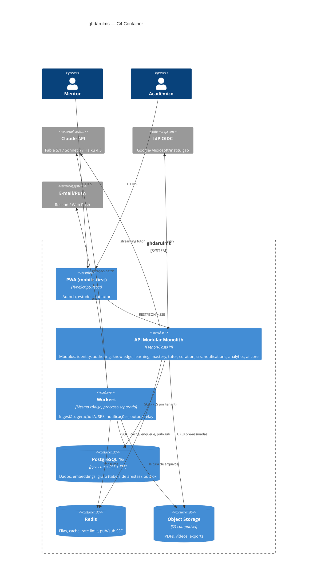
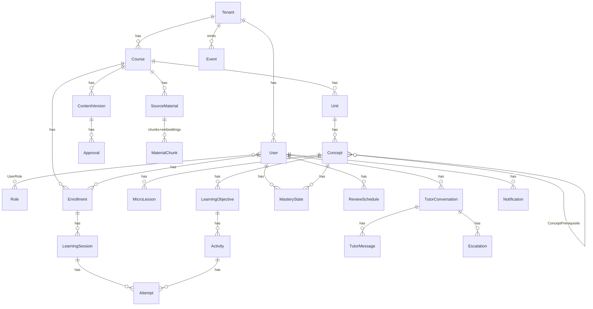

# ghdarulms — Especificação de Arquitetura & Backend

> Especialista: arquitetura de software / backend (sistemas distribuídos, APIs, modelagem de dados, filas, multi-tenant, LLMs em produção).

## 1. Visão arquitetural

**Decisão:** modular monolith em um único deployable (API + workers compartilham o mesmo código, processos distintos), com módulos que são bounded contexts explícitos. Cada módulo expõe uma interface interna (serviço de aplicação) e publica eventos de domínio; nenhum módulo lê tabelas de outro diretamente. Isso mantém a possibilidade de extrair `Tutor IA` ou `Ingestão` como serviço quando o custo/escala justificar, sem pagar o preço de microserviços com 3 devs.

| Módulo (bounded context) | Responsabilidade | Depende de |
|---|---|---|
| `identity` — Identidade & Tenancy | Tenants, usuários, papéis, sessões, convites, OIDC | — |
| `authoring` — Autoria/Conteúdo | Cursos, unidades, materiais-fonte, versões, aprovação | identity |
| `knowledge` — Grafo & Objetivos | Conceitos, pré-requisitos, objetivos Bloom, micro-lições, atividades | authoring |
| `learning` — Aprendizagem/Sessões | Matrículas, sessões de estudo, trilha, progressão | knowledge, mastery |
| `mastery` — Avaliação & Maestria | Correção de tentativas, evidências, `MasteryState`, regras de avanço | knowledge |
| `tutor` — Tutor IA | Conversas, RAG, streaming, escalonamento ao mentor | knowledge, mastery, ai-core |
| `curation` — Curadoria/Busca | Busca híbrida (FTS + vetorial), material complementar externo | authoring, ai-core |
| `srs` — Revisão Espaçada | Agendamento FSRS, fila diária de revisão | mastery |
| `notifications` | E-mail, push (Web Push/PWA), digest | identity |
| `analytics` | Event store xAPI-like, agregações, dashboards do mentor | todos (só consome eventos) |
| `ai-core` (infra transversal) | Gateway LLM, prompt registry, orçamento, guardrails, traces | — |



**Fluxo de ingestão (upload até fila de revisão):**

```mermaid
sequenceDiagram
  participant M as Mentor (PWA)
  participant A as API authoring
  participant S3 as Object Storage
  participant Q as Fila (Redis)
  participant W as Worker ingestão
  participant AI as ai-core → Claude
  participant DB as Postgres
  M->>A: POST /materials (Idempotency-Key)
  A->>S3: URL pré-assinada
  M->>S3: PUT arquivo
  M->>A: POST /materials/{id}/complete
  A->>DB: SourceMaterial status=UPLOADED + outbox(MaterialUploaded)
  DB-->>Q: relay outbox → job ingest(material_id)
  Q->>W: ingest
  W->>S3: baixa arquivo
  W->>W: extract (PDF/vídeo→transcrição/URL)
  W->>W: chunk (~500 tokens, overlap 10%)
  W->>AI: embed(chunks) [batch]
  W->>DB: chunks + embeddings; status=EMBEDDED
  W->>AI: extrair conceitos + pré-requisitos (JSON estruturado)
  W->>DB: Concepts + edges (status=DRAFT)
  W->>AI: objetivos por nível Bloom
  W->>AI: micro-lições + atividades (Batch API quando > N conceitos)
  W->>DB: ContentVersion status=PENDING_REVIEW + outbox(ContentReadyForReview)
  DB-->>Q: notificação
  Q-->>M: "Conteúdo pronto para revisão"
  M->>A: PATCH /versions/{id}/approve
```

## 2. Stack recomendada

| Camada | Principal | Alternativa | Justificativa |
|---|---|---|---|
| Linguagem/framework | **Python 3.12 + FastAPI** (Pydantic v2, SQLAlchemy 2 async, Alembic) | TypeScript + NestJS + Drizzle | Ecossistema de extração de PDF, NLP e avaliação (evals) é Python-first; SDK `anthropic` maduro com streaming e batches; time pequeno se beneficia de um único idioma para API e pipelines. NestJS é melhor se o front e o back forem compartilhar tipos e o time for majoritariamente TS. |
| Banco | **PostgreSQL 16 + pgvector (HNSW) + RLS + FTS (`tsvector`, dicionário `portuguese`)** | mesmo | Um único banco cobre relacional, vetorial, texto e grafo. O grafo de conceitos é pequeno (centenas de nós por curso): tabela de arestas + CTE recursiva (`WITH RECURSIVE`) resolve; Apache AGE só se surgirem consultas de caminho complexas. |
| Cache/filas | **Redis 7** | mesmo | Cache de sessão, rate limit (token bucket), pub/sub para SSE multi-instância, broker de filas. |
| Jobs | **Celery** (Redis broker, `acks_late`, filas por prioridade) — ou **arq** para menor peso | Temporal (quando pipelines exigirem sagas longas/duráveis) | Pipeline de ingestão é linear e idempotente por etapa; Celery basta. Temporal entra se houver workflows humanos-no-loop com dias de duração. |
| Object storage | **S3-compatível** (Cloudflare R2 / Tigris no Fly) | AWS S3 | Egress barato para vídeo; URLs pré-assinadas. |
| Busca | **Postgres FTS + pgvector (híbrida com RRF)** | Meilisearch | Evita mais um serviço; migrar a Meilisearch se a busca virar feature central de UX. |
| Realtime | **SSE** para streaming do tutor e progresso de ingestão | WebSocket só para colaboração ao vivo (não previsto no MVP) | SSE atravessa proxies/PWA sem fricção, reconecta sozinho (`Last-Event-ID`). |
| LLM | **Claude API** via SDK oficial | Bedrock/Vertex (dados em região específica) | Roteamento na seção 6. |

## 3. Modelo de dados

Todas as tabelas de negócio carregam `tenant_id` (RLS) e `created_at/updated_at`. IDs: UUIDv7 (ordenáveis).

| Entidade | Campos-chave | Relações |
|---|---|---|
| Tenant | id, slug, name, plan, settings(jsonb), token_budget_monthly, data_region | 1:N User, Course |
| User | id, tenant_id, email, name, auth_provider, status, pii_deleted_at | N:M Role via UserRole |
| Role | id, tenant_id, name (`owner`,`mentor`,`reviewer`,`student`), permissions(jsonb) | |
| Course | id, tenant_id, owner_id, title, target_bloom_level, status | 1:N Unit, SourceMaterial, Enrollment |
| Unit | id, course_id, order, title | 1:N Concept |
| Concept | id, unit_id, slug, name, summary, status(draft/approved), version_id | N:M Concept via ConceptPrerequisite |
| ConceptPrerequisite | concept_id, prerequisite_id, strength(0-1), source(ai/mentor) | PK composta; check anti-ciclo no service |
| LearningObjective | id, concept_id, bloom_level(1-6), verb, statement, order | 1:N Activity |
| SourceMaterial | id, course_id, kind(pdf/video/url/text), s3_key, sha256, status, license, injection_scan | 1:N MaterialChunk |
| MaterialChunk | id, material_id, ordinal, text, tokens, page/timestamp, embedding vector(1024), tsv | |
| MicroLesson | id, concept_id, bloom_level, version_id, body(markdown), duration_min, citations(jsonb) | |
| Activity | id, objective_id, type(mcq/short/open/code/case), bloom_level, prompt, rubric(jsonb), answer_key(jsonb, cifrado), difficulty | 1:N Attempt |
| Enrollment | id, course_id, user_id, status, started_at | 1:N LearningSession |
| LearningSession | id, enrollment_id, concept_id, started_at, ended_at, device | 1:N Attempt |
| Attempt (Evidence) | id, session_id, activity_id, user_id, concept_id, bloom_level, response(jsonb), score(0-1), grader(rule/llm/mentor), grader_trace_id, submitted_at | |
| MasteryState | user_id, concept_id, bloom_level, p_known, evidence_count, last_evidence_at, updated_at | PK (user, concept, bloom) |
| ReviewSchedule | id, user_id, concept_id, stability, difficulty, due_at, last_review_at, reps, lapses | FSRS por (user, concept) |
| TutorConversation | id, user_id, course_id, concept_id?, status, summary, token_usage | 1:N TutorMessage |
| TutorMessage | id, conversation_id, role, content, citations(jsonb), model, trace_id, created_at | |
| ContentVersion | id, course_id, number, status(draft/pending_review/approved/published), created_by, diff_summary | 1:N Approval |
| Approval | id, version_id, reviewer_id, decision, comment, decided_at | |
| Escalation | id, conversation_id, user_id, mentor_id, reason, status, resolved_at | |
| Notification | id, user_id, channel, template, payload, sent_at, read_at | |
| Event | id, tenant_id, actor_id, verb, object_type, object_id, result(jsonb), context(jsonb), occurred_at | append-only, particionado por mês |
| Outbox | id, aggregate, event_type, payload, created_at, published_at | relay → fila |
| PromptTemplate | id, name, version, model_default, body, schema(jsonb), eval_score | ai-core |
| LlmTrace | id, tenant_id, task, model, prompt_version, in_tokens, out_tokens, cache_read_tokens, cost_usd, latency_ms, stop_reason | sem PII |



## 4. APIs

**Estilo:** REST + OpenAPI 3.1 gerado pelo FastAPI; JSON; `Problem Details` (RFC 9457) para erros. GraphQL não se justifica: as telas têm shapes previsíveis e o custo de N+1/autorização por campo não compensa com 3 devs.

- **Versionamento:** prefixo `/v1`; mudanças breaking → `/v2` convivendo por 6 meses. Campos novos são sempre aditivos.
- **Paginação:** cursor-based (`?cursor=&limit=`) em todas as listas; ordenação por UUIDv7.
- **Idempotência:** header `Idempotency-Key` obrigatório em `POST /materials`, `POST /attempts`, `POST /tutor/.../messages`; chave armazenada em Redis 24h com o hash do body e a resposta.
- **Tenant scoping:** tenant derivado do JWT (`tid` claim), nunca da URL.

| Módulo | Endpoints principais |
|---|---|
| identity | `POST /auth/magic-link`, `GET /auth/oidc/{provider}/callback`, `POST /auth/refresh`, `GET /me`, `GET/POST /tenants/{t}/users`, `POST /tenants/{t}/invites` |
| authoring | `GET/POST /courses`, `POST /courses/{c}/materials` (retorna URL pré-assinada), `POST /materials/{m}/complete`, `GET /materials/{m}/status` (SSE opcional), `GET /courses/{c}/versions`, `POST /versions/{v}/approve|reject`, `POST /versions/{v}/publish` |
| knowledge | `GET /courses/{c}/graph`, `PATCH /concepts/{id}`, `POST /concepts/{id}/prerequisites`, `GET /concepts/{id}/objectives`, `GET /concepts/{id}/lessons`, `POST /concepts/{id}/regenerate` (job) |
| learning | `POST /courses/{c}/enroll`, `GET /me/next` (próximo conceito/atividade), `POST /sessions`, `PATCH /sessions/{s}/end` |
| mastery | `POST /attempts` (idempotente; resposta síncrona para regra, `202` + job para correção LLM), `GET /me/mastery?course=`, `GET /courses/{c}/mastery` (mentor) |
| tutor | `POST /tutor/conversations`, `POST /tutor/conversations/{id}/messages` → `202 {message_id}`, `GET /tutor/conversations/{id}/stream` (SSE: `token`, `citation`, `mastery_update`, `done`, `error`), `POST /tutor/conversations/{id}/escalate` |
| curation | `GET /search?q=&course=` (híbrida), `POST /concepts/{id}/supplements/suggest` (job), `POST /supplements/{id}/approve` |
| srs | `GET /me/reviews/due`, `POST /reviews/{id}/grade` (rating 1-4) |
| notifications | `GET /me/notifications`, `PATCH /notifications/{id}/read`, `PUT /me/notification-preferences`, `POST /me/push-subscriptions` |
| analytics | `POST /events` (batch xAPI-like do cliente), `GET /courses/{c}/analytics/overview`, `GET /courses/{c}/analytics/concepts` |
| webhooks | `POST /tenants/{t}/webhooks` (eventos: `content.published`, `enrollment.completed`, `escalation.created`, `mastery.threshold_reached`); assinatura HMAC-SHA256, retries exponenciais 5x, entrega registrada |

**SSE do tutor:** o `POST` cria a mensagem e enfileira; o cliente abre o `GET /stream` com `Last-Event-ID`. Workers publicam tokens em Redis pub/sub (`tutor:{conv_id}`); a API faz fan-out. Isso permite reconexão de PWA móvel sem perder tokens e desacopla a geração do request HTTP.

## 5. Pipelines assíncronos

**Máquina de estados de `SourceMaterial`:** `UPLOADED → EXTRACTED → CHUNKED → EMBEDDED → CONCEPTS_DRAFTED → OBJECTIVES_DRAFTED → LESSONS_DRAFTED → PENDING_REVIEW → APPROVED | FAILED(stage, reason)`.

| Etapa | Modelo/ferramenta | Idempotência | Retry | Custo estimado (PDF 50 pág ≈ 40k tokens) |
|---|---|---|---|---|
| extract | pypdf/pdfplumber, Whisper (vídeo), trafilatura (URL) | chave `sha256` do arquivo | 3x, backoff | ~0 (compute) |
| chunk | regra (500 tok, overlap 50) | determinístico por (material, versão do chunker) | 3x | 0 |
| embed | Voyage (`voyage-3`) ou modelo aberto self-hosted | `UPSERT` por (chunk_id) | 5x | ~US$ 0,01 |
| extract_concepts | Sonnet 5, structured output (`output_config.format`) | resultado gravado com `input_hash`; reexecução curto-circuita | 3x; fallback Fable 5.1 em baixa confiança | ~US$ 0,15 |
| gen_objectives | Sonnet 5 | por (concept_id, prompt_version) | 3x | ~US$ 0,05/conceito |
| gen_lessons_activities | Sonnet 5 via **Batch API** (50% off) quando > 10 conceitos | por (concept, bloom_level, prompt_version) | 3x | ~US$ 0,10/conceito/nível |
| supplements_search | Haiku 4.5 + `web_search` | por (concept, semana) | 2x | ~US$ 0,02/conceito |

Cada etapa é um job Celery separado com `task_id = f"{stage}:{material_id}:{version}"` e `acks_late=True`; o worker verifica o estado antes de rodar (skip se já avançou). Falhas após retries marcam `FAILED` e notificam o mentor com botão "reprocessar a partir da etapa X".

**Outbox pattern:** toda mutação que gera evento escreve na mesma transação uma linha em `outbox`; um relay (`SELECT ... FOR UPDATE SKIP LOCKED` a cada 500 ms) publica para Redis e marca `published_at`. Eventos principais: `MaterialUploaded`, `ConceptsDrafted`, `ContentReadyForReview`, `ContentPublished`, `AttemptGraded`, `MasteryUpdated`, `ReviewDue`, `EscalationCreated`. O módulo `analytics` consome tudo e grava `Event` (formato xAPI: actor/verb/object/result/context).

## 6. Serviço de IA (`ai-core`)

**Abstração:** interface `LlmGateway.complete(task, messages, schema?, stream?)`; implementações `AnthropicProvider` (padrão), `BedrockProvider`/`VertexProvider` (residência de dados). O domínio nunca importa o SDK diretamente.

**Roteamento por tarefa (configurável por tenant):**

| Tarefa | Modelo | Effort | Motivo |
|---|---|---|---|
| Extração de conceitos e grafo | `claude-sonnet-5` | high | Estruturado, precisa de qualidade; fallback `claude-fable-5-1` quando confiança < 0,7 ou material > 200k tokens |
| Objetivos, lições, atividades, rubricas | `claude-sonnet-5` (Batch) | medium | Volume alto, não latência-sensível |
| Tutor (chat streaming) | `claude-sonnet-5` | low/medium | TTFT < 1,5 s; escala para `claude-fable-5-1` em conversas nível Avaliar/Criar ou quando aluno pede aprofundamento |
| Correção de respostas abertas (LLM-judge) | `claude-sonnet-5` com rubrica | medium | Consistência; amostra de 5% revalidada por Fable 5.1 para calibrar |
| Classificação de intenção, sumário de conversa, triagem de escalonamento | `claude-haiku-4-5-20251001` | — | Barato e rápido |

Preços de referência (API primeira-parte): Fable 5.1 US$ 10/50 por MTok; Sonnet 5 US$ 2/10; Haiku 4.5 US$ 1/5. Observação de compliance: Fable 5.1 exige retenção de 30 dias na Anthropic (não disponível sob zero-data-retention) — registrar no DPA e na política de privacidade; para tenants que exigem ZDR, o roteamento omite Fable 5.1.

- **Prompt registry:** tabela `PromptTemplate` versionada (semver), com schema de saída, modelo default, effort e score de eval; deploy de prompt é uma migração de dados, não de código. Todo `LlmTrace` referencia `prompt_version`.
- **Prompt cache:** system prompt do tutor + contexto do curso (resumo do grafo, ~3-6k tokens) fixo no prefixo com `cache_control`; estado do aluno e chunks RAG entram depois do último breakpoint. Meta: `cache_read_input_tokens` > 70% nas conversas.
- **Limites por tenant:** token bucket em Redis (`rpm`, `tokens/min`) + orçamento mensal em `Tenant.token_budget_monthly`; ao atingir 80% notifica o owner, a 100% degrada (tutor → Haiku, geração pausada) em vez de bloquear.
- **Guardrails:** entrada — sanitização de HTML/markdown, limite de tamanho, detecção de injeção em material (ver §8), classificador Haiku para conteúdo fora de escopo; saída — validação de schema (structured outputs), verificação de que citações apontam para `chunk_id` existentes, filtro de PII, tratamento explícito de `stop_reason: "refusal"` (mensagem amigável + log).
- **Traces:** `LlmTrace` + spans OpenTelemetry com `tenant_id`, `task`, `prompt_version`, tokens, custo; **nunca** o conteúdo de mensagens em logs (conteúdo fica só em `TutorMessage`, cifrado em repouso).
- **Evals:** dataset por tarefa em `evals/` (≥ 50 casos golden por prompt), rodado em CI ao alterar prompt: exatidão de extração de conceitos (F1 contra gabarito do mentor), aderência Bloom (verbo ↔ nível), qualidade de correção (concordância com mentor, kappa ≥ 0,7), e "grounding" do tutor (% de afirmações citadas). Bloqueia deploy de prompt com regressão > 3 pontos.

## 7. Motor de maestria e SRS

**Estado:** `p_known(user, concept, bloom_level)`, inicial 0,1 (ou herdado: se nível N-1 do mesmo conceito tem p ≥ 0,85, inicial 0,3).

**Atualização (BKT simplificado, por evidência):**
```
p_learn = 0,15  p_slip = 0,10  p_guess = 0,20 (0,25 para MCQ de 4 opções)
score s ∈ [0,1] vindo do grader
p_correct_obs = p * (1 - p_slip) + (1 - p) * p_guess
p_post = s * [p(1-p_slip)/p_correct_obs] + (1-s) * [p·p_slip / (1 - p_correct_obs)]
p_known' = p_post + (1 - p_post) * p_learn
```
Evidências de baixa confiança (LLM-judge com `confidence < 0,6`) recebem peso 0,5 via interpolação. O módulo `mastery` é a única fonte de escrita; qualquer outro módulo (tutor, SRS) submete `Evidence` e recebe `MasteryUpdated`.

**Regras de avanço:**
- Nível Bloom N de um conceito está "dominado" quando `p_known ≥ 0,85` e `evidence_count ≥ 2`.
- Aluno pode iniciar conceito C no nível N se todos os pré-requisitos com `strength ≥ 0,5` estão dominados no nível `min(N, target_bloom_level)` — ou o mentor liberou manualmente.
- `GET /me/next` escolhe, por ordem: revisão vencida → conceito desbloqueado com menor `p_known` no nível corrente → próximo nível Bloom do conceito atual.
- Decaimento: sem evidência por 14 dias, `p_known` decai 5%/semana até piso de 0,4 (motiva revisão sem apagar histórico).

**SRS (FSRS-4.5):** uma `ReviewSchedule` por (user, concept); cada correção gera rating (1 Again, 2 Hard, 3 Good, 4 Easy) derivado de `score` e tempo; `due_at` calculado pela função de retrievabilidade alvo 0,9. Job diário `srs.schedule_due` gera `ReviewDue` → notificação. Uma revisão bem-sucedida também injeta evidência no BKT com peso 0,5.

**Como o tutor consome/atualiza:** no início da conversa recebe um bloco "estado do aluno" (conceitos dominados/fracos, nível Bloom atual, últimas 3 falhas) e o grafo local (conceito atual + pré-requisitos). Durante o chat usa ferramentas (`tool_use`): `get_mastery`, `search_material` (RAG), `propose_check` (gera mini-atividade) e `record_evidence` (envia ao módulo `mastery`, que decide o peso). O tutor nunca escreve `MasteryState` diretamente.

## 8. Segurança e LGPD

- **Autenticação:** OIDC (Google, Microsoft, IdP institucional via discovery) + magic link por e-mail (token 15 min, uso único). JWT de acesso curto (15 min) + refresh rotativo em cookie `HttpOnly`; PWA usa o mesmo fluxo.
- **Autorização:** RBAC por tenant (`Role.permissions`) verificado no service layer + **RLS no Postgres**: toda conexão executa `SET LOCAL app.tenant_id = ...`; políticas `USING (tenant_id = current_setting('app.tenant_id')::uuid)` em todas as tabelas. Workers usam o mesmo mecanismo, com `tenant_id` no payload do job. Defense-in-depth: bug de aplicação não vaza dados entre tenants.
- **Criptografia:** TLS 1.3; disco cifrado; `answer_key`, `TutorMessage.content` e e-mail cifrados por coluna (pgcrypto/KMS envelope). Segredos em cofre do provedor.
- **Retenção/anonimização:** conversas do tutor 12 meses (configurável por tenant); `Event` bruto 24 meses, depois agregado; contas inativas por 24 meses são anonimizadas (`User.pii_deleted_at`, e-mail → hash). Evidências e `MasteryState` ficam pseudonimizados para pesquisa pedagógica só com consentimento.
- **Direitos do titular:** `POST /me/export` (job gera JSON+PDF no S3, link válido 7 dias) e `POST /me/delete` (soft delete imediato + purga em 30 dias, propagada a S3 e traces). Registro de consentimento com versão dos termos.
- **Auditoria:** tabela `AuditLog` append-only (quem, o quê, quando, IP hash) para ações administrativas, aprovações, exportações e exclusões.
- **Prompt injection nos materiais:** materiais são dados, nunca instruções — chunks sempre entram em blocos delimitados (`<document>`) com instrução explícita no system prompt de ignorar comandos dentro deles; scanner heurístico + Haiku classifica chunks suspeitos (`SourceMaterial.injection_scan`) e o mentor é avisado; o tutor não tem ferramentas com efeitos colaterais além de `record_evidence` (que passa pelo motor de maestria com pesos limitados); instruções de operador vão em `system`, nunca concatenadas com conteúdo do usuário.

## 9. Infra e operação

- **Containers:** uma imagem; entrypoints `api`, `worker-ingest`, `worker-tutor`, `worker-cron`, `outbox-relay`.
- **Deploy MVP:** Fly.io (regiões `gru` + réplica de leitura), Postgres gerenciado (Neon ou Supabase se preferir RLS/Auth prontos), Upstash/Fly Redis, R2. Migrar para Kubernetes (EKS/GKE) quando houver > 3 regiões ou > 20 workers. Ambientes: `dev`, `staging`, `prod`.
- **CI/CD:** GitHub Actions — lint (ruff/mypy), testes, evals de prompt (amostra), build, migração Alembic com `--sql` revisado em PR, deploy canário 10% por 15 min com rollback automático em erro 5xx > 1%.
- **Migrações:** expand/contract (nunca dropar coluna no mesmo release); migrações de dados como jobs.
- **Backups:** PITR 7 dias + snapshot diário 30 dias; S3 versionado; teste de restore mensal.
- **Observabilidade:** OpenTelemetry (traces API → job → LLM), logs JSON com `trace_id`/`tenant_id` e sem PII, métricas Prometheus: `llm_cost_usd{tenant,task,model}`, `llm_ttft_seconds`, `cache_hit_ratio`, `ingest_stage_duration`, `mastery_updates_total`. Dashboards Grafana; alertas em SLO burn rate.
- **SLOs:** TTFT do tutor p95 < 1,5 s (Sonnet 5 streaming + cache); API p95 < 300 ms (excluindo SSE e uploads); ingestão de PDF 50 pág < 10 min até `PENDING_REVIEW`; disponibilidade 99,5% MVP → 99,9%.
- **Escalabilidade:** API stateless (escala horizontal); workers escalam por profundidade de fila; pgvector HNSW particionado por tenant grande; réplica de leitura para analytics; SSE via Redis pub/sub permite múltiplas instâncias de API.

## 10. Testes

- **Unit:** motor BKT/FSRS (propriedades: monotonicidade, limites [0,1]), regras de avanço, detecção de ciclos no grafo, cálculo de RRF; cobertura alvo 80% nos módulos `mastery`, `srs`, `knowledge`.
- **Integração:** Postgres real (testcontainers) com RLS ativa — teste obrigatório "tenant A não lê tenant B" para cada tabela; outbox → fila → consumer.
- **Contract tests de API:** OpenAPI como fonte; Schemathesis gera casos; o front consome tipos gerados do mesmo spec; testes de compatibilidade `/v1` a cada PR.
- **Evals de IA:** suites por prompt (§6) com LLM-judge (Fable 5.1 como juiz das saídas de Sonnet 5) + gabaritos humanos; rodam em CI (amostra) e nightly (completo); resultados versionados junto ao prompt.
- **Carga:** k6 simulando 500 conversas simultâneas do tutor (SSE) e 50 uploads concorrentes; metas: TTFT p95, erro < 0,5%, sem starvation da fila de ingestão (filas separadas).
- **Segurança:** testes de injeção com corpus de prompts adversariais em materiais; ZAP baseline; revisão de dependências (pip-audit).

## 11. Requisitos de Backend

| ID | Requisito | Prioridade |
|---|---|---|
| BE-01 | Modular monolith com módulos isolados, comunicação por serviços internos e eventos de domínio | Must |
| BE-02 | Multi-tenancy com `tenant_id` em todas as tabelas e RLS ativa no Postgres | Must |
| BE-03 | Autenticação OIDC + magic link; JWT curto com refresh rotativo | Must |
| BE-04 | RBAC com papéis owner/mentor/reviewer/student | Must |
| BE-05 | Upload via URL pré-assinada com idempotência e verificação de hash | Must |
| BE-06 | Pipeline de ingestão assíncrono com estados, retries e reprocessamento por etapa | Must |
| BE-07 | Chunking + embeddings em pgvector com busca híbrida (FTS + vetorial) | Must |
| BE-08 | Extração de conceitos e grafo de pré-requisitos com validação anti-ciclo | Must |
| BE-09 | Geração de objetivos Bloom, micro-lições e atividades com structured outputs | Must |
| BE-10 | Fluxo de versão/aprovação de conteúdo pelo mentor antes de publicar | Must |
| BE-11 | Tutor IA com RAG, ferramentas de maestria e streaming SSE reconectável | Must |
| BE-12 | Motor de maestria BKT por (aluno, conceito, nível Bloom) como única fonte de escrita | Must |
| BE-13 | Regras de avanço e endpoint `GET /me/next` | Must |
| BE-14 | Gateway LLM provider-agnostic com roteamento por tarefa e prompt registry versionado | Must |
| BE-15 | Rate limit e orçamento de tokens por tenant com degradação graciosa | Must |
| BE-16 | Traces de LLM com custo por tenant, sem PII em logs | Must |
| BE-17 | Outbox pattern para eventos de domínio e store de eventos xAPI-like | Must |
| BE-18 | Exportação e exclusão de dados do titular (LGPD) com propagação a S3 e traces | Must |
| BE-19 | Proteção contra prompt injection em materiais (delimitação, scanner, ferramentas sem efeitos colaterais) | Must |
| BE-20 | OpenAPI 3.1, versionamento `/v1`, paginação por cursor, Problem Details | Must |
| BE-21 | Revisão espaçada FSRS com job diário e notificações | Should |
| BE-22 | Correção de respostas abertas por LLM-judge com rubrica e amostra de calibração | Should |
| BE-23 | Prompt caching no tutor com meta de cache hit > 70% | Should |
| BE-24 | Batch API para geração em massa de lições/atividades | Should |
| BE-25 | Escalonamento tutor → mentor com triagem automática | Should |
| BE-26 | Webhooks assinados com retries para eventos de tenant | Should |
| BE-27 | Suite de evals de IA em CI com bloqueio por regressão | Should |
| BE-28 | Observabilidade OpenTelemetry + SLOs com alertas de burn rate | Should |
| BE-29 | Busca de material complementar externo com aprovação do mentor | Could |
| BE-30 | Roteamento a Bedrock/Vertex por residência de dados do tenant | Could |
| BE-31 | Réplica de leitura dedicada para analytics | Could |
| BE-32 | Migração para Kubernetes e filas Temporal para workflows longos | Could |
